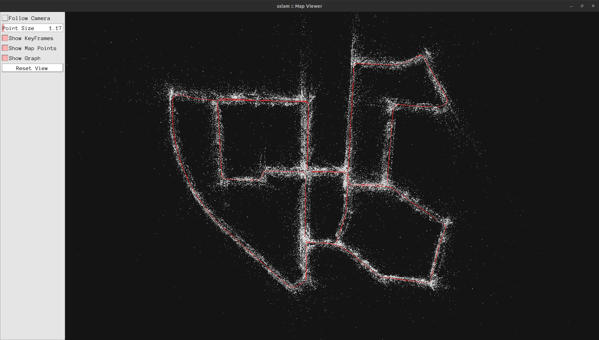

# sslam — Stereo Visual SLAM

A from-scratch stereo visual SLAM system in C++17, built for learning and benchmarking. Architecture follows ORB-SLAM3 with three concurrent threads: **Tracking**, **Local Mapping**, and **Loop Closing**.

## Build

```bash
sudo apt install libeigen3-dev libopencv-dev libsuitesparse-dev \
                 libgoogle-glog-dev libgflags-dev libpangolin-dev \
                 libfmt-dev libspdlog-dev libgtest-dev
git submodule update --init --recursive
cmake -S . -B build -DCMAKE_BUILD_TYPE=Release
cmake --build build -j$(nproc)
```

## Run

```bash
./build/apps/kitti_stereo /path/to/kitti/sequences/00 configs/kitti.yaml
```

## Tech Stack

- **C++17**, CMake
- Eigen 3.4, Sophus — geometry & Lie groups
- OpenCV 4 — feature extraction (ORB), stereo matching
- g2o — bundle adjustment & pose graph optimization
- DBoW2 — bag-of-words place recognition
- spdlog, GTest, Pangolin

## Results — KITTI Odometry

| Seq | Frames | ATE (aligned) | Loop closures |
|-----|--------|---------------|---------------|
| 00  | 4541   | 2.90 m        | 5             |
| 02  | 4661   | 6.95 m        | 1             |
| 05  | 2761   | 1.07 m        | 3             |
| 07  | 1101   | 3.44 m        | 0             |
| 08  | 4071   | 9.35 m        | 0             |

> Deterministic benchmark (`SSLAM_DETERMINISTIC=1`, local BA window = 15, final BA enabled for loop sequences with 20 final iterations).
> ATE = Absolute Trajectory Error after Umeyama alignment.

### KITTI Seq 00 — Pangolin Map Viewer

Map points (white) and keyframe trajectory (red) after full sequence
processing with loop closure.  The two large intersecting loops of the
Karlsruhe campus route are clearly resolved.



### Combined Top-Down Comparison


## Architecture

```
stereo frames
      │
      ▼
Tracking thread (30 Hz)  ──▶ pose
      │ keyframes
      ▼
Local Mapping (~5 Hz)    ──▶ Map (shared, mutex-protected)
      │ keyframes              ▲
      ▼                        │
Loop Closing (~1 Hz)  ─────────┘
```

## License

TBD.
